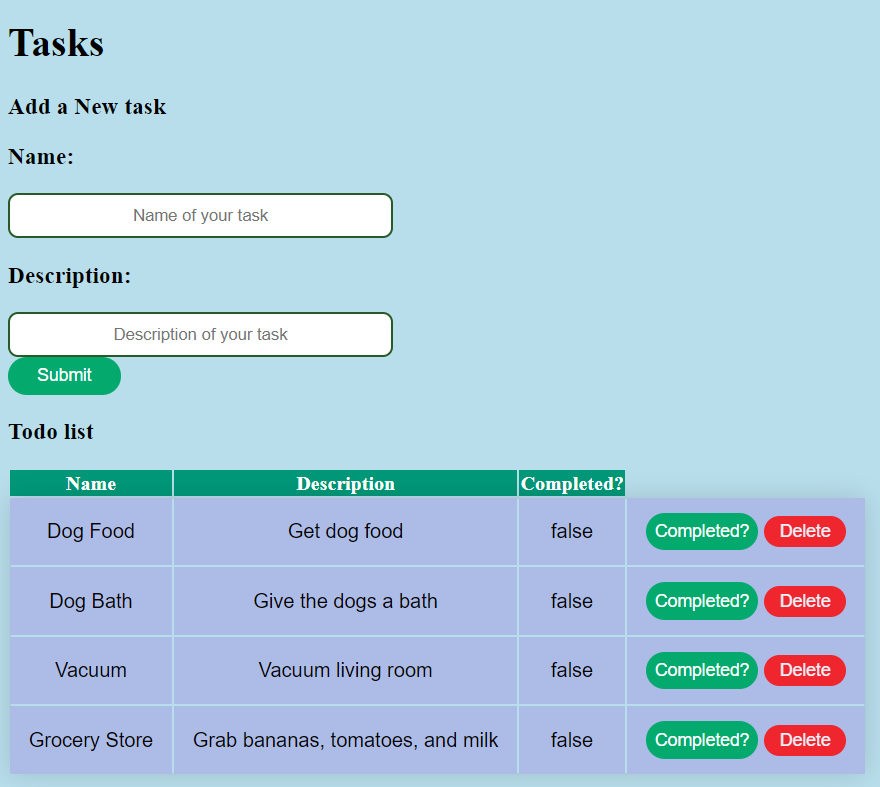
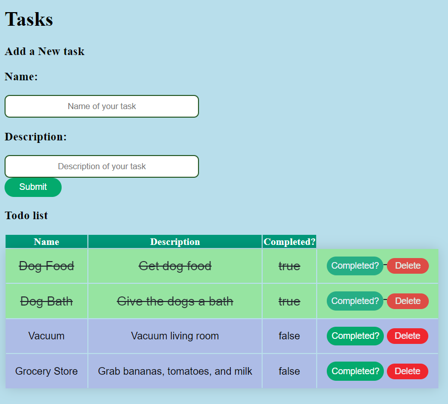

    

# The To-Do- App

## Table of Contents

- [Description](#description)
- [Screenshots](#screenshots)
- [Built With](#built-with)
  - [Prerequisites](#prerequisites)
  - [Installation](#installation)
- [Usage](#usage)
- [License](#license)
- [Acknowledgements](#acknowledgements)
- [Contacts](#contacts)

## Description

Duration: About 13 hours for base-mode.

I created a to-do app to organize and keep track of chores and other tasks.
I created a front end experience that allows a user to create a Task.
When the Task is created, it is stored inside of a database.
Whenever a Task is created the front end should refresh to show all tasks that need to be completed.
Each Task has an option to mark 'Complete' or 'Delete'.
When a Task is complete, its visual representation changes on the front end.
Deleting a Task removes it both from the front end as well as the database.

## Screenshots

## Built With

### Prerequisites

Postgres and Postico.

### Installation

I have included a 'database.sql' file within the project. Use those queries to create a sql database and the content within.

## Usage

1.  Be sure to create a new database through Postico. Use the name `weekend-to-do-app`.
2.  Type in name and description of your new task.
3.  Click submit.
4.  If you complete a task, you can click the 'Complete?' button.
5.  Click delete once you want to clear that task from your to-do-list.

## License

<a href="https://choosealicense.com/licenses/mit/">MIT License</a>

## Acknowledgements

Thanks to [Prime Digital Academy](www.primeacademy.io) who equipped and helped me to make this application a reality. Thanks to my instructor, Liz. Also, my undying thanks and gratitude to my classmates in the Jemisin cohort for their generosity and support.

## Contacts

 
